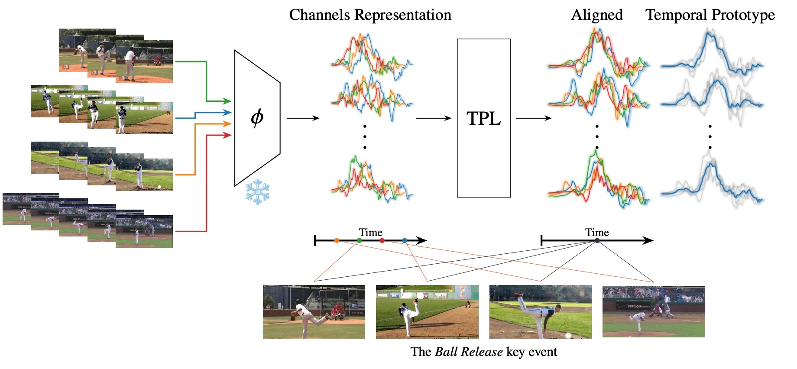

# Synchronization of Multiple Videos
Official repository for Synchronization of Multiple Videos. ICCV 2025.

Avihai Naaman*, [Ron Shapira Weber*](https://ronshapiraweber.github.io/), and [Oren Freifeld](https://www.cs.bgu.ac.il/~orenfr/)

*Indicates Equal Contribution

## Code coming soon...
